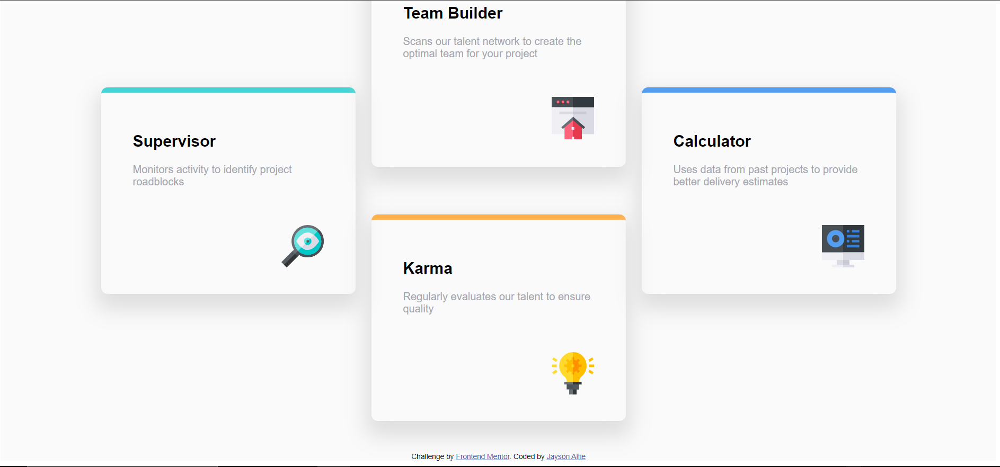
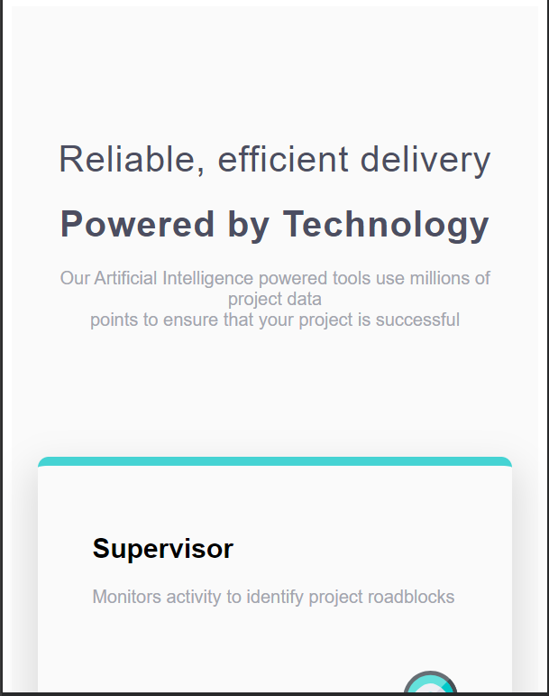
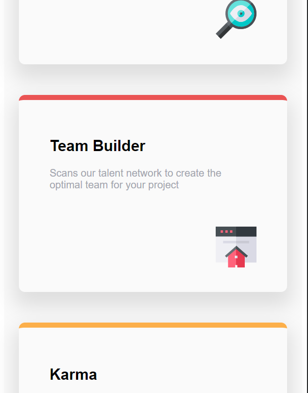
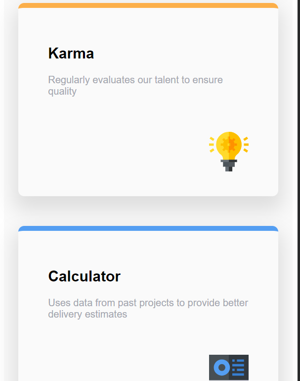

# Frontend Mentor - Four card feature section solution

This is a solution to the [Four card feature section challenge on Frontend Mentor](https://www.frontendmentor.io/challenges/four-card-feature-section-weK1eFYK). Frontend Mentor challenges help you improve your coding skills by building realistic projects.

## Table of contents

- [Overview](#overview)
  - [The challenge](#the-challenge)
  - [Screenshot](#screenshot)
  - [Links](#links)
- [My process](#my-process)
  - [Built with](#built-with)
  - [Useful resources](#useful-resources)
- [Author](#author)

## Overview

### The challenge

Users should be able to:

- View the optimal layout for the site depending on their device;s screen size

### Screenshot

### links
- Solution URL : [https://github.com/jaysonalfie/Four-card-feature-section.git](https://github.com/jaysonalfie/Four-card-feature-section.git)
- Live Site URL : [https://four-card-feature-section-two-lake.vercel.app/](https://four-card-feature-section-two-lake.vercel.app/)

## My process
I was able to use React together with Vite to create the webpage and it was also an opportunity to look into CSS grid and how it works so as to properly style the cards. I also used flex in the arrangement of components in the webpage. I used Vanilla CSS for styling. I was also able to use the mobile first approach through the media queries to attain responsivity.

### Built with
- Semantic HTML5 markup
- Css custom properties
- [React](https://reactjs.org/) - JS library
- [Vite](https://vitejs.dev/) - Code bundler

## Resources
- [MDN Docs](https://developer.mozilla.org/en-US/)
- [React](https://reactjs.org/)
- [Vite](https://vitejs.dev/)

## Author
- Github - [Jaysonalfie](https://github.com/jaysonalfie)
- Frontend mentor - [Jaysonalfie](https://www.frontendmentor.io/profile/jaysonalfie)